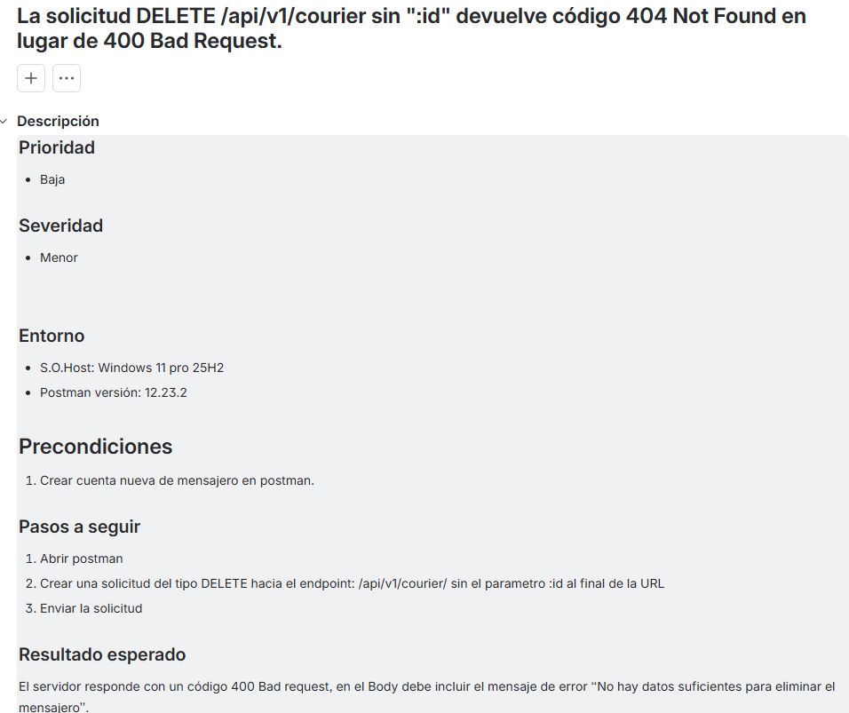

# 🛴 Proyecto: Urban Scooter — Pruebas de API & Aplicación Móvil

## 📌 Descripción del Proyecto
Urban Scooter es un servicio de logística y gestión de alquiler de scooters. En este proyecto se realizaron pruebas integrales sobre el backend (API REST), la lógica de negocio y la interfaz de usuario de la aplicación móvil.

---

## 🛠️ Herramientas y Entorno de Pruebas
* **Pruebas de API:** Postman (Validación de respuestas DTO, HTTP Status Codes y colecciones).
* **Gestión de Base de Datos:** SQL (PostgreSQL para validación de persistencia de datos).
* **Gestión de Defectos:** Jira.
* **Pruebas Móviles:** Android Studio (Emulador Pixel 5) / Chrome DevTools.

---

## 🚀 Alcance de las Pruebas

### 1. Pruebas de API con Postman
Se diseñaron y ejecutaron colecciones de prueba para verificar los endpoints principales del servicio:
* `POST /api/v1/courier` — Creación de repartidores (validación de campos obligatorios, límite de caracteres y duplicados).
* `POST /api/v1/courier/login` — Autenticación y generación de sesiones.
* `DELETE /api/v1/courier/:id` — Eliminación de registros y verificación de manejo de errores (`404 Not Found`).

📂 **Descarga de evidencia:**  
* [Descargar Colección de Postman (.json)](./Urban-Scooter-Postman.json)

---

### 2. Evidencias de Defectos Reportados en Jira

#### Defecto 1: Inconsistencia en la respuesta de la API al crear repartidor con datos duplicados
* **Severidad:** Alta
* **Resultado Esperado:** El back end debe rechazar al intentar eliminar un repartidor sin ingresar "id" con código '400 Bad Request´.
* **Resultado Obtenido:** El servidor responde con un código: 404 Not Found, el Body invluye el mensaje de error “Not Found”.


---

#### Defecto 2: Fallo de validación al eliminar un repartidor inexistente
* **Severidad:** Media
* **Resultado Esperado:** Al enviar un ID inexistente, el servidor debe responder con código `404 Not Found`.
* **Resultado Obtenido:** El servidor responde con error `500 Internal Server Error`.


---

### 3. Consultas SQL de Verificación
Se ejecutaron consultas a la base de datos para corroborar que las acciones realizadas a través de la API impactaran correctamente en las tablas:

```sql
-- Verificación de eliminación de un repartidor
SELECT * FROM "Couriers" WHERE id = 12345;
